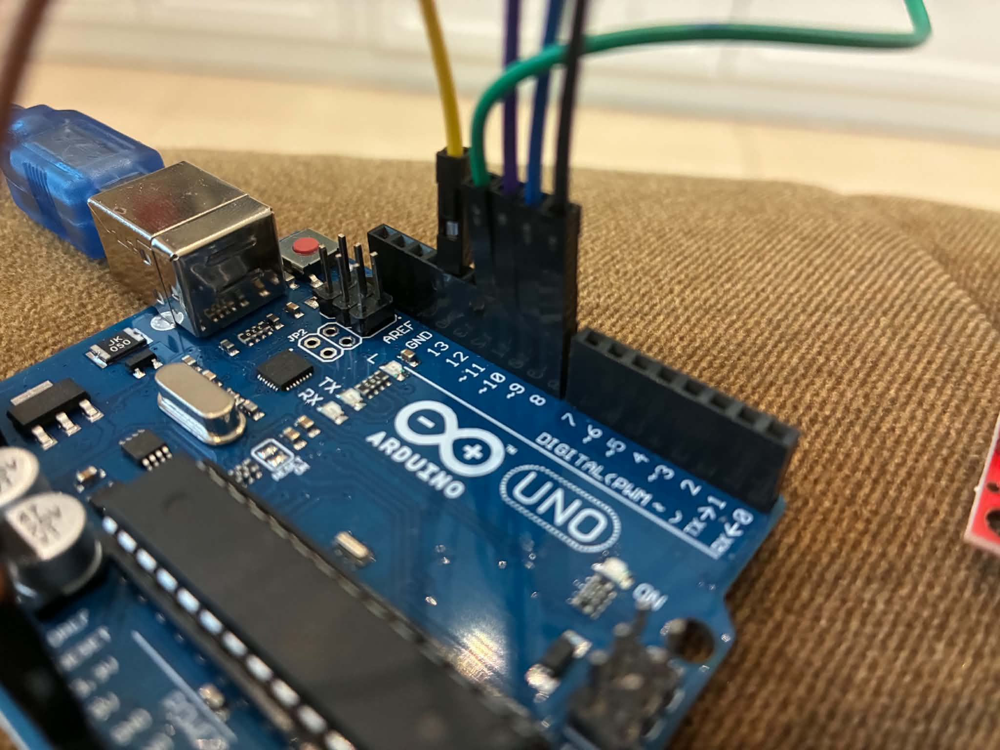
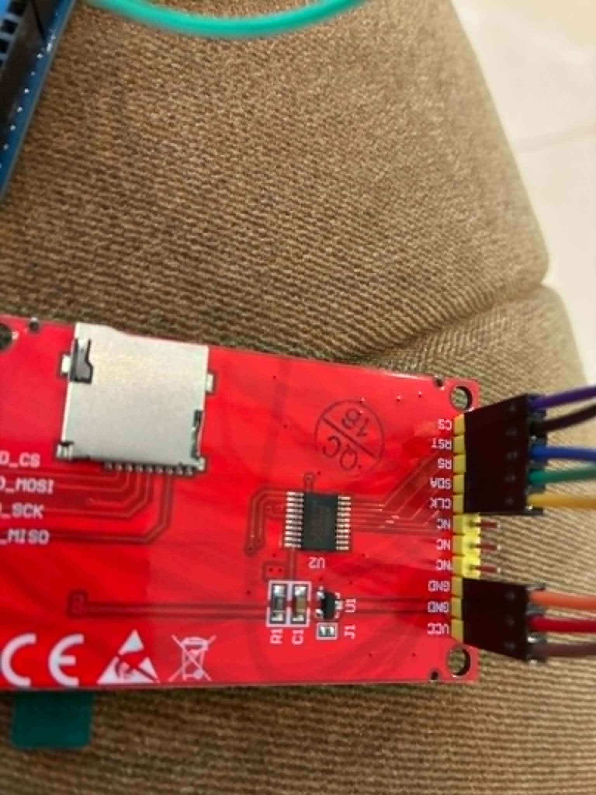

# Projects
MINI SEA SLUG tft odel s creen aruino without sd card.
this is my fist porject so i dont know what im relly doing.
Hope you enjoy doing this project and making your own custom sea slug.

## How it looks

    

i have even an video one version.

https://github.com/user-attachments/assets/b28520b9-0026-4ea7-a197-85c3b23b5495

It is quite low quality but whatever. 
You can see that the slug is very small. It is because i dont have an sd card, but you an implement there.

## Theory
If you dont have an sd vard than you have an limited space on the UNO 32 kb.
I have an color format of RGB565 (16 bit RRRRRGGGGGGBBBBB) and that is 2 bytes per pixel.
100 x 100 = 10000 pixels. then you have to multiply it by 2 so that 20000 bytes.
So one image is 20 kb. I have 4 pictures so 20 x 4 = 80 kb and that over the uno.

But this animations is okay so you can use it without an sd vard if you dont mind very small animations.

## What you need
an arduino of coure
tft oled 
arduino ide program
and installed st7735, SPI library and AdafuitGFX
your images converted to c array file. You can find some on the internet.
you have to be smart haha
Know your wiring which is or few pretty complicated.

## Wiring
You can in your code change what is RST(RESET), CS(CHIP SLELECT), DC(DATA COMAND).
But some you have to follow.
Well gnd you have to put in gnd of couse and vcc do 3.3 volt.
The 3.3 volt is important because some components can handle 5 volt and they can short circut. 
And if you use 3.3 then you will be safe from short circuit. If it ssint enougf power then just put it to 5 volt.
Do deep research for your components !
SPI uses clock wires called CLK or SCK and even SCL bt thats only in Ic2 sometimes. These pins, wire them to pin 13.
If there is mosi wire it to pin 11, if there is miso wire it to pin 12.
Creful! Some cheap screen SDA and SCL even tho they use SPI. SDA in this is mosi and SCL is SCK.
the only ones you have to define in you code are the RST CS DC and more.
If you have one that is none of thee do for it research.
My oled doesnt have to be the same as yours. 

    
    
    

## what you have to know
You will have to need to know the parametrs of you screen. It is very important.
Also try to understand the code.I will try to explain it in th future
## Ending
If i made any mistakes, tell me, i no pro at this.

